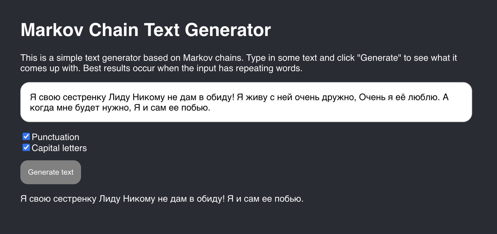

# Markov Chain Text Generator

Text generator that builds Markov chains from your input and spits out new sentences.

## What's this about

Each word is treated as a state. The next word is picked randomly from words that followed the current one in the source text — probability based on frequency. It keeps going until it hits an end token.

It's no GPT, but the results are hilariously weird. I got the idea after reading a [series on Markov chains](https://thecode.media/markov-chain/) on the Y.Practicum blog — fun articles, easy to follow, made me want to try it myself.



## How to launch

```bash
npm install
npm start
```

Opens on `localhost:3000`. Production build goes to `./docs`.

## Demo

[nomomon.github.io/markov-chain-text](https://nomomon.github.io/markov-chain-text/)
